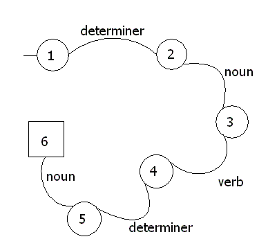



## Finite State Machine example: checking syntax

### Description

This is an example of what can be done with the finite state machine code I have uploaded (see my other submissions). It shows how you can define a particular grammar and how to check to see if that sentance fits this grammar/syntax. This would be helpful for text adventures etc, and should also give you an idea about how else you can implement other systems using FSMs. The output is printed to the debug window (Ctrl-G).
 
### More Info
 

             |
---                |---
**Submitted On**   |2003-03-04 22:17:04
**By**             |[Matt Dibb](https://github.com/Planet-Source-Code/PSCIndex/blob/master/ByAuthor/matt-dibb.md)
**Level**          |Intermediate
**User Rating**    |5.0 (10 globes from 2 users)
**Compatibility**  |VB 4\.0 \(16\-bit\), VB 4\.0 \(32\-bit\), VB 5\.0, VB 6\.0
**Category**       |[Math/ Dates](https://github.com/Planet-Source-Code/PSCIndex/blob/master/ByCategory/math-dates__1-37.md)
**World**          |[Visual Basic](https://github.com/Planet-Source-Code/PSCIndex/blob/master/ByWorld/visual-basic.md)
**Archive File**   |[Finite\_Sta155457342003\.zip](https://github.com/Planet-Source-Code/matt-dibb-finite-state-machine-example-checking-syntax__1-43753/archive/master.zip)

